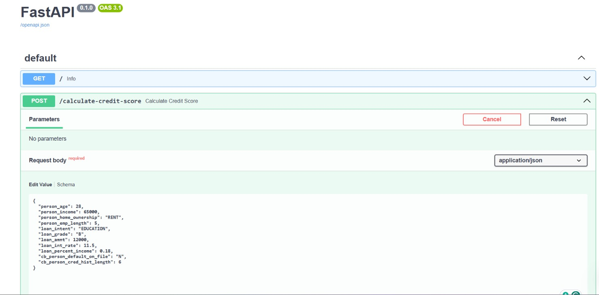
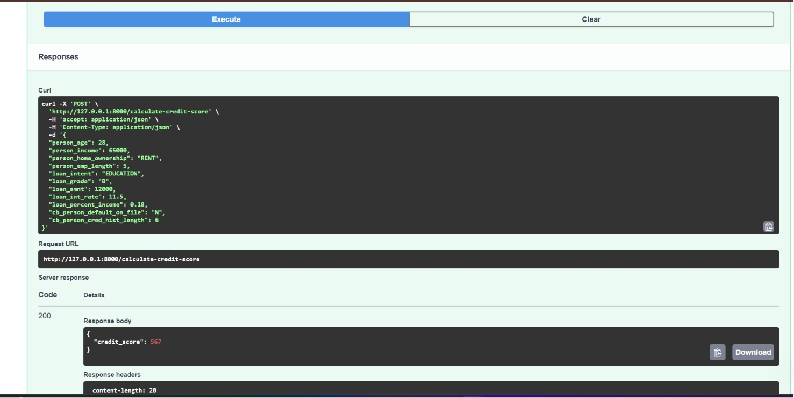
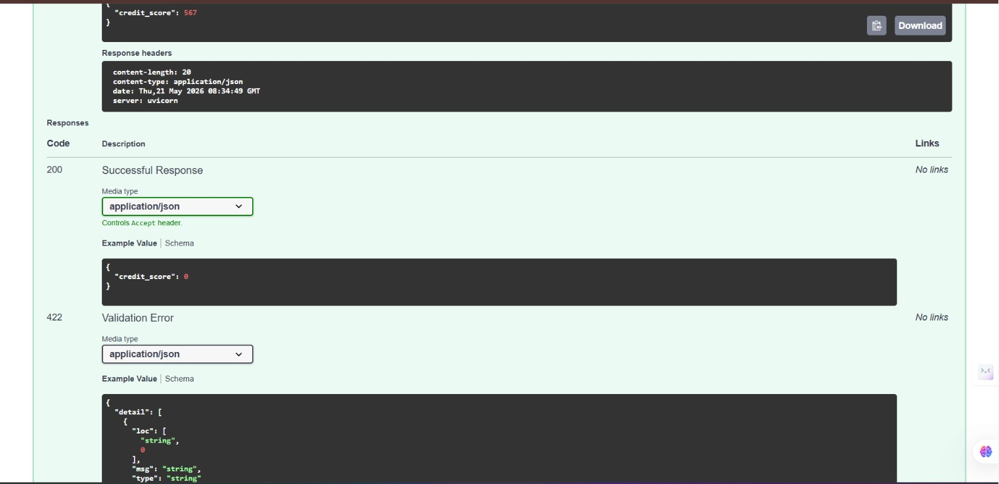

# SmartCredit Risk Engine

An end-to-end ML-powered credit risk prediction system built using FastAPI, Scikit-learn, and MLOps principles.

This project predicts customer credit scores using machine learning models and exposes predictions through a production-style REST API with interactive Swagger documentation.

---

## Features

- Credit score prediction using Machine Learning
- FastAPI-powered REST API
- Interactive Swagger API documentation
- Real-time inference pipeline
- JSON request/response support
- Docker-ready architecture
- Modular MLOps project structure
- Scorecard generation system

---

## Demo Video

[Watch Project Demo](https://youtu.be/zLfexMf7kts)

---

## API Demo Screenshots

### Swagger UI



---

### Request Body Example



---

### Prediction Result



---

## Tech Stack

- Python
- FastAPI
- Scikit-learn
- Pandas
- NumPy
- Uvicorn
- Docker

---

## Project Structure

```bash
SmartCredit-Risk-Engine/
│
├── api/
├── app/
├── credit_score_mlops/
├── data/
├── models/
├── notebooks/
├── reports/
├── images/
├── Dockerfile
├── params.yaml
├── pyproject.toml
└── README.md
```

---

## API Endpoint

### Calculate Credit Score

```http
POST /calculate-credit-score
```

---

## Sample API Request

```json
{
  "person_age": 28,
  "person_income": 65000,
  "person_home_ownership": "RENT",
  "person_emp_length": 5,
  "loan_intent": "EDUCATION",
  "loan_grade": "B",
  "loan_amnt": 12000,
  "loan_int_rate": 11.5,
  "loan_percent_income": 0.18,
  "cb_person_default_on_file": "N",
  "cb_person_cred_hist_length": 6
}
```

---

## Sample API Response

```json
{
  "credit_score": 567
}
```

---

## cURL Example

```bash
curl -X POST "http://127.0.0.1:8000/calculate-credit-score" \
-H "accept: application/json" \
-H "Content-Type: application/json" \
-d '{
  "person_age": 28,
  "person_income": 65000,
  "person_home_ownership": "RENT",
  "person_emp_length": 5,
  "loan_intent": "EDUCATION",
  "loan_grade": "B",
  "loan_amnt": 12000,
  "loan_int_rate": 11.5,
  "loan_percent_income": 0.18,
  "cb_person_default_on_file": "N",
  "cb_person_cred_hist_length": 6
}'
```

---

## System Architecture

User / Client  
↓  
FastAPI Backend  
↓  
Input Validation  
↓  
ML Pipeline  
↓  
Credit Score Prediction  
↓  
JSON API Response

---

## Installation

Clone the repository:

```bash
git clone https://github.com/sardarbashis/SmartCredit-Risk-Engine.git
```

Move into the project directory:

```bash
cd SmartCredit-Risk-Engine
```

Create virtual environment:

```bash
python -m venv venv
```

Activate virtual environment:

### Windows

```bash
venv\Scripts\activate
```

Install dependencies:

```bash
pip install -r requirements.txt
```

Run FastAPI server:

```bash
python -m uvicorn api.api:app --reload
```

Open Swagger documentation:

```bash
http://127.0.0.1:8000/docs
```

---

## Future Improvements

- SHAP explainability integration
- Deployment on Render/Railway
- Streamlit dashboard redesign
- Batch CSV predictions
- Authentication system
- Monitoring & logging dashboard

---

## Author

Ashis Kumar Sardar

GitHub:
https://github.com/sardarbashis

